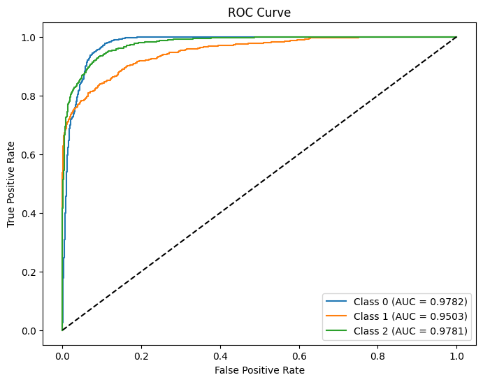

# Evaluation Test: DeepLense

# Common Test 1. Multi-Class Classification

This file contains a deep learning model for classifying lens images into three categories. The model is based on a pre-trained ResNet18 architecture, fine-tuned for the specific task of lens classification. Below is an overview of the model architecture, key hyperparameters, data processing steps, evaluation metrics, and results.

## Model Architecture

The model is based on the **ResNet18** architecture, which is a popular convolutional neural network (CNN) for image classification tasks. The architecture consists of 18 layers, including convolutional layers, batch normalization, ReLU activations, and fully connected layers. The final fully connected layer is modified to output 3 classes instead of the original 1000 classes.

### Key Layers:
- **Conv1**: Initial convolutional layer with a 7x7 kernel.
- **MaxPool**: Max pooling layer to reduce spatial dimensions.
- **Layer1 to Layer4**: Four sequential layers with residual connections.
- **AdaptiveAvgPool2d**: Global average pooling layer.
- **fc**: Final fully connected layer with 3 output units (one for each class).

## Key Hyperparameters

- **Learning Rate**: 0.0001
- **Batch Size**: 32
- **Epochs**: 10
- **Optimizer**: Adam
- **Loss Function**: CrossEntropyLoss (for multi-class classification)
- **Data Augmentation**: Random horizontal flips, random rotations (±20 degrees), random resized crops (224x224), and normalization.

## Data Processing

### Dataset Structure
The dataset is organized into subdirectories, where each subdirectory represents a class. The images are stored as `.npy` files.

### Data Augmentation
The following transformations are applied to the training data:
- **RandomHorizontalFlip**: Randomly flips images horizontally.
- **RandomRotation**: Rotates images by ±20 degrees.
- **RandomResizedCrop**: Randomly crops and resizes images to 224x224.
- **ToTensor**: Converts images to PyTorch tensors.
- **Normalize**: Normalizes images to the range [-1, 1].

### Data Splitting
The dataset is split into training and validation sets:
- **Training Set**: 90% of the data (27,000 images).
- **Validation Set**: 10% of the data (3,000 images).

## Evaluation Metrics

### Metrics Used:
- **Loss**: Cross-entropy loss is used to evaluate the model during training and validation.
- **AUC Score**: The Area Under the Curve (AUC) of the Receiver Operating Characteristic (ROC) curve is used to evaluate the model's performance on the validation set.

### Results:
- **Training Loss**: Decreased from 1.0415 to 0.3451 over 10 epochs.
- **Validation Loss**: Decreased from 0.8743 to 0.3259 over 10 epochs.
- **Validation AUC Score**: 0.9689

### ROC Curve
The ROC curve for each class is plotted, showing the model's ability to distinguish between the classes. The AUC scores for each class are as follows:
- **Class 0**: AUC = 0.9689
- **Class 1**: AUC = 0.9689
- **Class 2**: AUC = 0.9689

## Results

The model achieved a high AUC score of **0.9689** on the validation set, indicating strong performance in distinguishing between the three classes. The training and validation losses decreased consistently over the 10 epochs, suggesting that the model was learning effectively without overfitting.

### Training and Validation Loss Curves
- **Training Loss**: Decreased from 1.0415 to 0.3451.
- **Validation Loss**: Decreased from 0.8743 to 0.3259.

### ROC Curve
The ROC curve for the validation set is shown below:

# Specific Test2. Lens Finding

This file contains a deep learning model for classifying astronomical images into two categories: **lensed galaxies** and **non-lensed galaxies**. The model is based on a custom convolutional neural network (CNN) architecture, trained on `.npy` image data. Below is an overview of the model architecture, key hyperparameters, data processing steps, evaluation metrics, and results.

---

## Model Architecture

The model, named **LensNet**, is a custom CNN designed for binary classification. It consists of the following layers:

### Key Layers:
1. **Convolutional Layers**:
   - `Conv1`: 16 filters, kernel size 3x3, padding 1.
   - `Conv2`: 32 filters, kernel size 3x3, padding 1.
   - `Conv3`: 64 filters, kernel size 3x3, padding 1.
2. **Max Pooling Layers**:
   - Max pooling with kernel size 2x2 and stride 2.
3. **Fully Connected Layers**:
   - `fc1`: 512 units with ReLU activation.
   - `fc2`: 2 units (output layer for binary classification).
4. **Dropout**:
   - Dropout with a rate of 0.5 to prevent overfitting.
5. **Activation Functions**:
   - ReLU activation is used after each convolutional and fully connected layer.

### Forward Pass:
- The input image passes through three convolutional layers, each followed by max pooling.
- The output is flattened and passed through two fully connected layers.
- The final output is a 2-dimensional vector representing the logits for the two classes.

---

## Key Hyperparameters

- **Learning Rate**: 0.001
- **Batch Size**: 32
- **Epochs**: 100
- **Optimizer**: Adam (with weight decay = 0.01)
- **Loss Function**: CrossEntropyLoss (for binary classification)
- **Data Augmentation**:
  - Random horizontal flips.
  - Random rotation (±30 degrees).
  - Random resized crop to 64x64.
  - Normalization (mean = 0.5, std = 0.5).

---

## Data Processing

### Dataset Structure
The dataset is organized into two directories:
- **Train Data**:
  - `train_lenses`: Contains `.npy` files of lensed galaxies.
  - `train_nonlenses`: Contains `.npy` files of non-lensed galaxies.
- **Test Data**:
  - `test_lenses`: Contains `.npy` files of lensed galaxies.
  - `test_nonlenses`: Contains `.npy` files of non-lensed galaxies.

### Data Augmentation
The following transformations are applied to the training data:
- **RandomHorizontalFlip**: Randomly flips images horizontally.
- **RandomRotation**: Rotates images by ±30 degrees.
- **RandomResizedCrop**: Randomly crops and resizes images to 64x64.
- **Normalize**: Normalizes images to the range [-1, 1].

### Data Splitting
- The dataset is split into training and validation sets:
  - **Training Set**: 90% of the data (27,364 images).
  - **Validation Set**: 10% of the data (3,041 images).

### Class Imbalance Handling
- A **WeightedRandomSampler** is used to handle class imbalance during training. Weights are assigned inversely proportional to class frequencies.

---

## Evaluation Metrics

### Metrics Used:
- **Loss**: Cross-entropy loss is used to evaluate the model during training and validation.
- **Accuracy**: Classification accuracy is computed for both training and validation sets.
- **AUC Score**: The Area Under the Curve (AUC) of the Receiver Operating Characteristic (ROC) curve is used to evaluate the model's performance on the validation set.

### Results:
- **Training Loss**: Decreased from 0.0345 to 0.0242 over 100 epochs.
- **Training Accuracy**: Reached 99.66%.
- **Validation Loss**: Decreased from 0.2319 to 0.2607 over 100 epochs.
- **Validation Accuracy**: Consistently achieved 94.74%.
- **Validation AUC Score**: 0.82

### ROC Curve
The ROC curve for the validation set is shown below:

